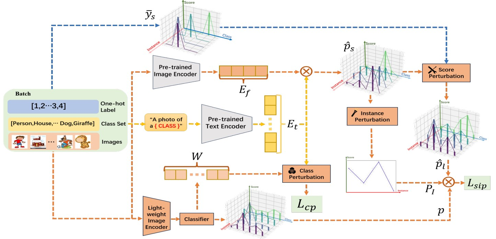
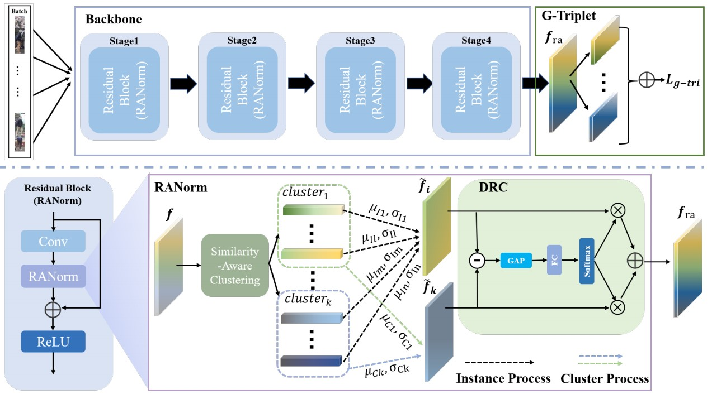
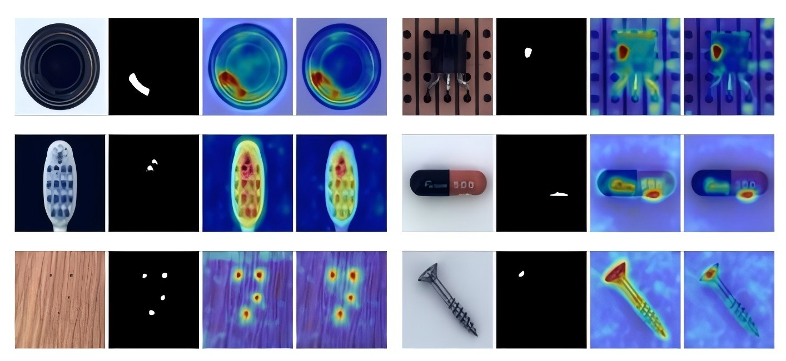
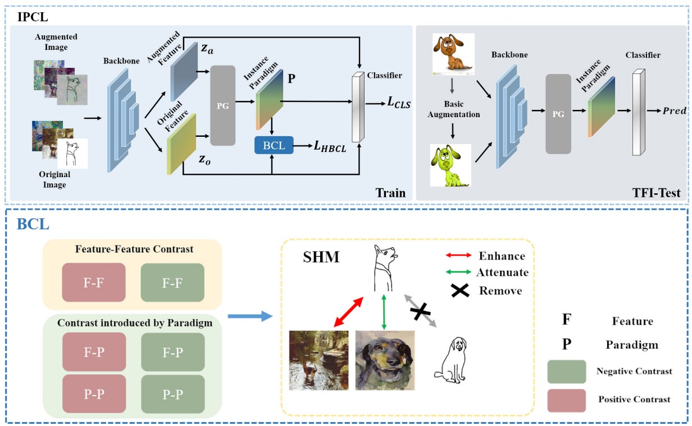
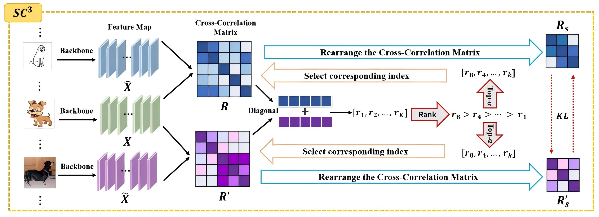








# About Me

I am a Ph.D. candidate at the [Multimedia Communication and Pattern Recognition Lab](https://mcprl.com/), School of Artificial Intelligence, Beijing University of Posts and Telecommunications, under the supervision of Prof. Zhicheng Zhao. Currently, I am a visiting scholar at the [College of Computing and Data Science](https://www.ntu.edu.sg/computing), Nanyang Technological University, Singapore, supervised by [Prof. Shijian Lu](https://personal.ntu.edu.sg/shijian.lu/). Before that, I obtained my Bacholar's Degree from Beijing University of Posts and Telecommunications in 2021.

My research interest includes computer vision and machine learning, especially on domain generalization for various applications. My research also focuses on multi-modal learning, including vision-language model for downstream applications. The aim of my research is to construct robust learning algorithms, to effectively and adaptively generalize to diverse scenarios.

Please feel free to contact me if you're interested in my research direction.

# 🔥 News 
- *2024.12*: 🎉🎉 My academic homepage is created!

# 📝 Publications 

**PracticalDG: Perturbation Distillation on Vision-Language Models for Hybrid Domain Generalization** 
**Zining Chen**, Weiqiu Wang, Zhicheng Zhao, Fei Su, Aidong Men, Hongying Meng 
Conference on Computer Vision and Pattern Recognition (**CVPR**), 2024 
<a href="https://openaccess.thecvf.com/content/CVPR2024/papers/Chen_PracticalDG_Perturbation_Distillation_on_Vision-Language_Models_for_Hybrid_Domain_Generalization_CVPR_2024_paper.pdf">[Paper]</a>
<a href="https://github.com/znchen666/HDG">[Code]</a> 

**Cluster-instance normalization: A statistical relation-aware normalization for generalizable person re-identification** 
**Zining Chen**, Weiqiu Wang, Zhicheng Zhao, Fei Su, Aidong Men, Yuan Dong 
IEEE Transactions on Multimedia (**TMM**), 2023 
<a href="https://ieeexplore.ieee.org/document/10243072">[Paper]</a>

**Filter or Compensate: Towards Invariant Representation from Distribution Shift for Anomaly Detection** 
**Zining Chen**, Xingshuang Luo, Weiqiu Wang, Zhicheng Zhao, Fei Su, Aidong Men  
AAAI Conference on Artificial Intelligence (**AAAI**), 2025  
<a href="https://arxiv.org/abs/2412.10115">[Paper]</a>
<a href="https://github.com/znchen666/FiCo">[Code]</a>

**Instance Paradigm Contrastive Learning for Domain Generalization** 
**Zining Chen**, Weiqiu Wang, Zhicheng Zhao, Fei Su, Aidong Men, Yuan Dong 
IEEE Transactions on Circuits and Systems for Video Technology (**TCSVT**), 2023 
<a href="https://ieeexplore.ieee.org/document/10163491/">[Paper]</a> 

**Selective Cross-Correlation Consistency Loss for Out-of-Distribution Generalization** 
**Zining Chen**, Weiqiu Wang, Zhicheng Zhao, Fei Su, Aidong Men 
IEEE International Conference on Multimedia and Expo (**ICME**), 2024 
<a href="https://ieeexplore.ieee.org/document/10688222/">[Paper]</a> 

# ⭐ Honors and Awards
- *2024.11* National Scholarship, Ministry of Education of P.R. China.
- *2024.09* "Huawei Cup" The 6th China Graduate AI Innovation Competition - National Second Prize
- *2024.07* China Scholarship Council (CSC) Scholarship, Ministry of Education of P.R. China.
- *2023.10* "Schlumberger" Enterprise Scholarship.
- *2023.10* Outstanding Graduate of Beijing University of Posts and Telecommunications.
- *2022.09* Winner of NICOChallenge 2022.
- *2020.08* National Innovation and Entrepreneurship Program for College Students.
- *2018.11-2024.11* Beijing University of Posts and Telecommunications Scholarship (7 times).

# 🚩 Miscellaneous
- Academic Reviewer:
  IEEE TIP, IEEE TNNLS, IEEE TCSVT, CVPR, AAAI, ACMMM
- Language:
  TOEFL 105/120, CET-4 646, CET-6 559
- Hobby:
  Piano

